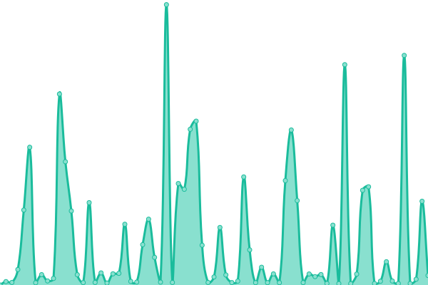
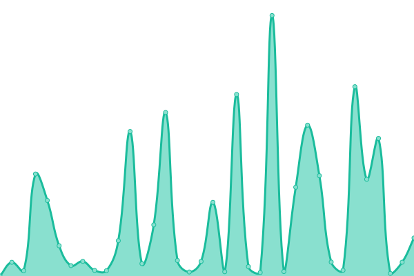

# [📈 Live Status](https://status.alefvanoon.xyz): <!--live status--> **🟧 Partial outage**

This repository contains the open-source uptime monitor and status page for [Upptime](https://upptime.js.org), powered by [Upptime](https://github.com/upptime/upptime).

With [Upptime](https://upptime.js.org), you can get your own unlimited and free uptime monitor and status page, powered entirely by a GitHub repository. We use [Issues](https://github.com/upptime/upptime/issues) as incident reports, [Actions](https://github.com/alefvanoon/status/actions) as uptime monitors, and [Pages](https://status.alefvanoon.xyz) for the status page.

<!--start: status pages-->
<!-- This summary is generated by Upptime (https://github.com/upptime/upptime) -->
<!-- Do not edit this manually, your changes will be overwritten -->
<!-- prettier-ignore -->
| URL | Status | History | Response Time | Uptime |
| --- | ------ | ------- | ------------- | ------ |
|  [Blog](https://alefvanoon.xyz) | 🟩 Up | [blog.yml](https://github.com/alefvanoon/Status/commits/HEAD/history/blog.yml) | 

 119ms
     
 | 

<a href="https://status.alefvanoon.xyz/history/blog">100.00%</a>
    

|  [Whoogle](https://s.alefvanoon.xyz) | 🟩 Up | [whoogle.yml](https://github.com/alefvanoon/Status/commits/HEAD/history/whoogle.yml) | 

 248ms
     
 | 

<a href="https://status.alefvanoon.xyz/history/whoogle">99.77%</a>
    

|  [Metasearch](https://ss.alefvanoon.xyz) | 🟩 Up | [metasearch.yml](https://github.com/alefvanoon/Status/commits/HEAD/history/metasearch.yml) | 

 235ms
     
 | 

<a href="https://status.alefvanoon.xyz/history/metasearch">100.00%</a>
    

|  [Nitter](https://nitter.alefvanoon.xyz) | 🟩 Up | [nitter.yml](https://github.com/alefvanoon/Status/commits/HEAD/history/nitter.yml) | 

 214ms
     
 | 

<a href="https://status.alefvanoon.xyz/history/nitter">97.49%</a>
    

|  [Nitter.ir](https://nitter.ir) | 🟩 Up | [nitter-ir.yml](https://github.com/alefvanoon/Status/commits/HEAD/history/nitter-ir.yml) | 

 514ms
     
 | 

<a href="https://status.alefvanoon.xyz/history/nitter-ir">100.00%</a>
    

|  [Libreddit](https://libreddit.alefvanoon.xyz) | 🟩 Up | [libreddit.yml](https://github.com/alefvanoon/Status/commits/HEAD/history/libreddit.yml) | 

 1318ms
     
 | 

<a href="https://status.alefvanoon.xyz/history/libreddit">100.00%</a>
    

|  [Teddit](https://teddit.alefvanoon.xyz) | 🟩 Up | [teddit.yml](https://github.com/alefvanoon/Status/commits/HEAD/history/teddit.yml) | 

 1724ms
     
 | 

<a href="https://status.alefvanoon.xyz/history/teddit">100.00%</a>
    

|  [CloudTube](https://tube.alefvanoon.xyz) | 🟩 Up | [cloud-tube.yml](https://github.com/alefvanoon/Status/commits/HEAD/history/cloud-tube.yml) | 

 228ms
     
 | 

<a href="https://status.alefvanoon.xyz/history/cloud-tube">100.00%</a>
    

|  [Bibliogram](https://biblio.alefvanoon.xyz) | 🟩 Up | [bibliogram.yml](https://github.com/alefvanoon/Status/commits/HEAD/history/bibliogram.yml) | 

 211ms
     
 | 

<a href="https://status.alefvanoon.xyz/history/bibliogram">100.00%</a>
    

|  [Searx](https://sx.alefvanoon.xyz) | 🟩 Up | [searx.yml](https://github.com/alefvanoon/Status/commits/HEAD/history/searx.yml) | 

 244ms
     
 | 

<a href="https://status.alefvanoon.xyz/history/searx">100.00%</a>
    

|  [Translate](https://translate.alefvanoon.xyz) | 🟩 Up | [translate.yml](https://github.com/alefvanoon/Status/commits/HEAD/history/translate.yml) | 

 148ms
     
 | 

<a href="https://status.alefvanoon.xyz/history/translate">100.00%</a>
    

|  [WBO](https://wbo.alefvanoon.xyz) | 🟩 Up | [wbo.yml](https://github.com/alefvanoon/Status/commits/HEAD/history/wbo.yml) | 

 228ms
     
 | 

<a href="https://status.alefvanoon.xyz/history/wbo">100.00%</a>
    

|  [HedgeDoc](https://mdpad.alefvanon.xyz) | 🟩 Up | [hedge-doc.yml](https://github.com/alefvanoon/Status/commits/HEAD/history/hedge-doc.yml) | 

 389ms
     
 | 

<a href="https://status.alefvanoon.xyz/history/hedge-doc">100.00%</a>
    

|  [RSS-Bridge](https://rssb.alefvanon.xyz) | 🟩 Up | [rss-bridge.yml](https://github.com/alefvanoon/Status/commits/HEAD/history/rss-bridge.yml) | 

 847ms
     
 | 

<a href="https://status.alefvanoon.xyz/history/rss-bridge">100.00%</a>
    

|  [ytdl](https://yt.alefvanon.xyz) | 🟩 Up | [ytdl.yml](https://github.com/alefvanoon/Status/commits/HEAD/history/ytdl.yml) | 

 347ms
     
 | 

<a href="https://status.alefvanoon.xyz/history/ytdl">91.89%</a>
    

|  [invidious](https://inv.alefvanoon.xyz) | 🟥 Down | [invidious.yml](https://github.com/alefvanoon/Status/commits/HEAD/history/invidious.yml) | 

 0ms
     
 | 

<a href="https://status.alefvanoon.xyz/history/invidious">0.00%</a>
    

|  [Piped-Front](https://piped.alefvanoon.xyz) | 🟩 Up | [piped-front.yml](https://github.com/alefvanoon/Status/commits/HEAD/history/piped-front.yml) | 

 111ms
     
 | 

<a href="https://status.alefvanoon.xyz/history/piped-front">100.00%</a>
    

|  [Piped-API](https://piped-api.alefvanoon.xyz/trending?region=US) | 🟩 Up | [piped-api.yml](https://github.com/alefvanoon/Status/commits/HEAD/history/piped-api.yml) | 

 708ms
     
 | 

<a href="https://status.alefvanoon.xyz/history/piped-api">100.00%</a>
    

|  [PipedP](https://pipedp.alefvanoon.xyz) | 🟩 Up | [piped-p.yml](https://github.com/alefvanoon/Status/commits/HEAD/history/piped-p.yml) | 

 200ms
     
 | 

<a href="https://status.alefvanoon.xyz/history/piped-p">100.00%</a>
    

|  [Bandwidth Hero](https://bh.alefvanoon.xyz) | 🟩 Up | [bandwidth-hero.yml](https://github.com/alefvanoon/Status/commits/HEAD/history/bandwidth-hero.yml) | 

 202ms
     
 | 

<a href="https://status.alefvanoon.xyz/history/bandwidth-hero">90.82%</a>
    

|  [SpeedTest](https://fast.alefvanoon.xyz) | 🟩 Up | [speed-test.yml](https://github.com/alefvanoon/Status/commits/HEAD/history/speed-test.yml) | 

 101ms
     
 | 

<a href="https://status.alefvanoon.xyz/history/speed-test">91.91%</a>
    

|  [Send](https://send.alefvanoon.xyz) | 🟥 Down | [send.yml](https://github.com/alefvanoon/Status/commits/HEAD/history/send.yml) | 

 288ms
     
 | 

<a href="https://status.alefvanoon.xyz/history/send">0.00%</a>
    

|  [FreshRSS](https://rss.alefvanoon.xyz) | 🟥 Down | [fresh-rss.yml](https://github.com/alefvanoon/Status/commits/HEAD/history/fresh-rss.yml) | 

 299ms
     
 | 

<a href="https://status.alefvanoon.xyz/history/fresh-rss">0.00%</a>
    

|  [Etherpad](https://pad.alefvanoon.xyz) | 🟥 Down | [etherpad.yml](https://github.com/alefvanoon/Status/commits/HEAD/history/etherpad.yml) | 

 286ms
     
 | 

<a href="https://status.alefvanoon.xyz/history/etherpad">0.00%</a>
    

|  [CyberChef](https://cyberchef.alefvanoon.xyz) | 🟩 Up | [cyber-chef.yml](https://github.com/alefvanoon/Status/commits/HEAD/history/cyber-chef.yml) | 

 106ms
     
 | 

<a href="https://status.alefvanoon.xyz/history/cyber-chef">100.00%</a>
    

|  [Wikiless](https://wikiless.alefvanoon.xyz) | 🟩 Up | [wikiless.yml](https://github.com/alefvanoon/Status/commits/HEAD/history/wikiless.yml) | 

 399ms
     
 | 

<a href="https://status.alefvanoon.xyz/history/wikiless">100.00%</a>
    

|  [SimplyTranslate](https://st.alefvanoon.xyz) | 🟩 Up | [simply-translate.yml](https://github.com/alefvanoon/Status/commits/HEAD/history/simply-translate.yml) | 

 298ms
     
 | 

<a href="https://status.alefvanoon.xyz/history/simply-translate">100.00%</a>
    

|  [SimpleerTube](https://stube.alefvanoon.xyz) | 🟩 Up | [simpleer-tube.yml](https://github.com/alefvanoon/Status/commits/HEAD/history/simpleer-tube.yml) | 

 228ms
     
 | 

<a href="https://status.alefvanoon.xyz/history/simpleer-tube">100.00%</a>
    

<!--end: status pages-->

[**Visit our status website →**](https://status.alefvanoon.xyz)

## 📄 License

- Powered by: [Upptime](https://github.com/upptime/upptime)
- Code: [MIT](./LICENSE) © [Upptime](https://upptime.js.org)
- Data in the `./history` directory: [Open Database License](https://opendatacommons.org/licenses/odbl/1-0/)
