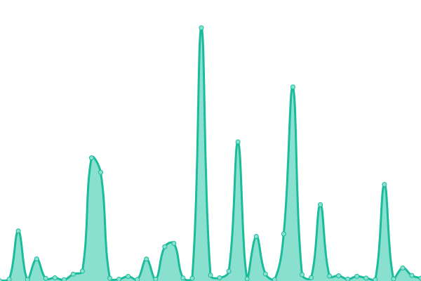
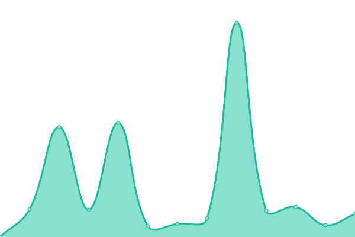
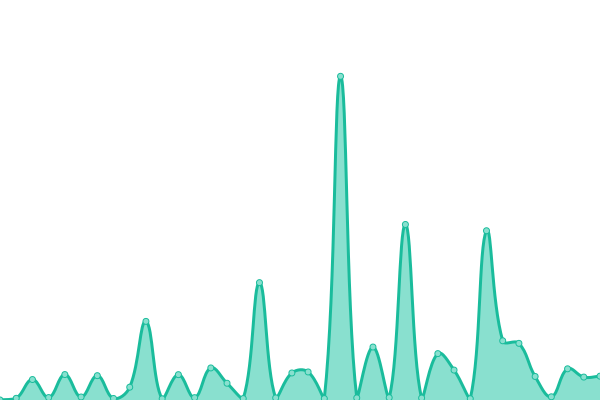
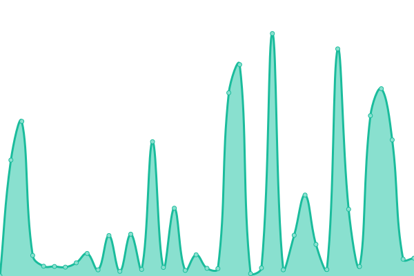
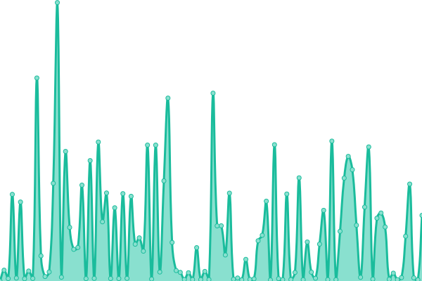
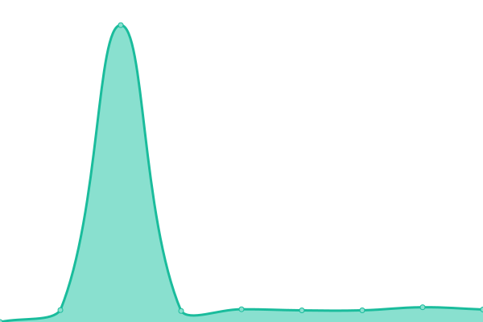

# [📈 Live Status](https://status.alefvanoon.xyz): <!--live status--> **🟩 All systems operational**

This repository contains the open-source uptime monitor and status page for [Upptime](https://upptime.js.org), powered by [Upptime](https://github.com/upptime/upptime).

With [Upptime](https://upptime.js.org), you can get your own unlimited and free uptime monitor and status page, powered entirely by a GitHub repository. We use [Issues](https://github.com/upptime/upptime/issues) as incident reports, [Actions](https://github.com/alefvanoon/status/actions) as uptime monitors, and [Pages](https://status.alefvanoon.xyz) for the status page.

<!--start: status pages-->
<!-- This summary is generated by Upptime (https://github.com/upptime/upptime) -->
<!-- Do not edit this manually, your changes will be overwritten -->
<!-- prettier-ignore -->
| URL | Status | History | Response Time | Uptime |
| --- | ------ | ------- | ------------- | ------ |
|  [Blog](https://alefvanoon.xyz) | 🟩 Up | [blog.yml](https://github.com/alefvanoon/Status/commits/HEAD/history/blog.yml) | 

 361ms
     
 | 

<a href="https://status.alefvanoon.xyz/history/blog">100.00%</a>
    

|  [Whoogle](https://s.alefvanoon.xyz) | 🟩 Up | [whoogle.yml](https://github.com/alefvanoon/Status/commits/HEAD/history/whoogle.yml) | 

 367ms
     
 | 

<a href="https://status.alefvanoon.xyz/history/whoogle">99.55%</a>
    

|  [Metasearch](https://ss.alefvanoon.xyz) | 🟩 Up | [metasearch.yml](https://github.com/alefvanoon/Status/commits/HEAD/history/metasearch.yml) | 

 3273ms
     
 | 

<a href="https://status.alefvanoon.xyz/history/metasearch">100.00%</a>
    

|  [Nitter](https://nitter.alefvanoon.xyz) | 🟩 Up | [nitter.yml](https://github.com/alefvanoon/Status/commits/HEAD/history/nitter.yml) | 

 408ms
     
 | 

<a href="https://status.alefvanoon.xyz/history/nitter">70.18%</a>
    

|  [Libreddit](https://libreddit.alefvanoon.xyz) | 🟩 Up | [libreddit.yml](https://github.com/alefvanoon/Status/commits/HEAD/history/libreddit.yml) | 

 1519ms
     
 | 

<a href="https://status.alefvanoon.xyz/history/libreddit">99.69%</a>
    

|  [CloudTube](https://tube.alefvanoon.xyz) | 🟩 Up | [cloud-tube.yml](https://github.com/alefvanoon/Status/commits/HEAD/history/cloud-tube.yml) | 

 289ms
     
 | 

<a href="https://status.alefvanoon.xyz/history/cloud-tube">100.00%</a>
    

|  [Bibliogram](https://biblio.alefvanoon.xyz) | 🟩 Up | [bibliogram.yml](https://github.com/alefvanoon/Status/commits/HEAD/history/bibliogram.yml) | 

 2124ms
     
 | 

<a href="https://status.alefvanoon.xyz/history/bibliogram">99.70%</a>
    

|  [Searx](https://sx.alefvanoon.xyz) | 🟩 Up | [searx.yml](https://github.com/alefvanoon/Status/commits/HEAD/history/searx.yml) | 

 325ms
     
 | 

<a href="https://status.alefvanoon.xyz/history/searx">98.63%</a>
    

|  [Translate](https://translate.alefvanoon.xyz) | 🟩 Up | [translate.yml](https://github.com/alefvanoon/Status/commits/HEAD/history/translate.yml) | 

 312ms
     
 | 

<a href="https://status.alefvanoon.xyz/history/translate">100.00%</a>
    

|  [WBO](https://wbo.alefvanoon.xyz) | 🟩 Up | [wbo.yml](https://github.com/alefvanoon/Status/commits/HEAD/history/wbo.yml) | 

 215ms
     
 | 

<a href="https://status.alefvanoon.xyz/history/wbo">100.00%</a>
    

|  [HedgeDoc](https://mdpad.alefvanon.xyz) | 🟩 Up | [hedge-doc.yml](https://github.com/alefvanoon/Status/commits/HEAD/history/hedge-doc.yml) | 

 364ms
     
 | 

<a href="https://status.alefvanoon.xyz/history/hedge-doc">100.00%</a>
    

|  [RSS-Bridge](https://rssb.alefvanon.xyz) | 🟩 Up | [rss-bridge.yml](https://github.com/alefvanoon/Status/commits/HEAD/history/rss-bridge.yml) | 

 869ms
     
 | 

<a href="https://status.alefvanoon.xyz/history/rss-bridge">100.00%</a>
    

|  [ytdl](https://yt.alefvanon.xyz) | 🟩 Up | [ytdl.yml](https://github.com/alefvanoon/Status/commits/HEAD/history/ytdl.yml) | 

 483ms
     
 | 

<a href="https://status.alefvanoon.xyz/history/ytdl">100.00%</a>
    

|  [invidious](https://inv.alefvanoon.xyz) | 🟩 Up | [invidious.yml](https://github.com/alefvanoon/Status/commits/HEAD/history/invidious.yml) | 

 508ms
     
 | 

<a href="https://status.alefvanoon.xyz/history/invidious">87.25%</a>
    

<!--end: status pages-->

[**Visit our status website →**](https://status.alefvanoon.xyz)

## 📄 License

- Powered by: [Upptime](https://github.com/upptime/upptime)
- Code: [MIT](./LICENSE) © [Upptime](https://upptime.js.org)
- Data in the `./history` directory: [Open Database License](https://opendatacommons.org/licenses/odbl/1-0/)
